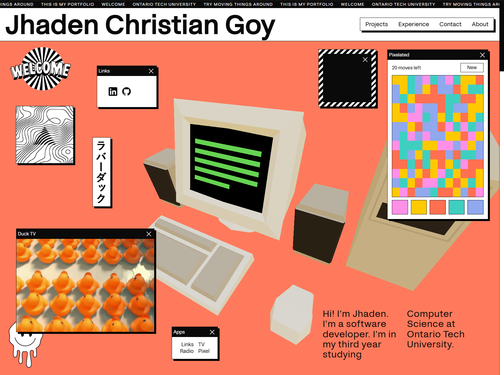
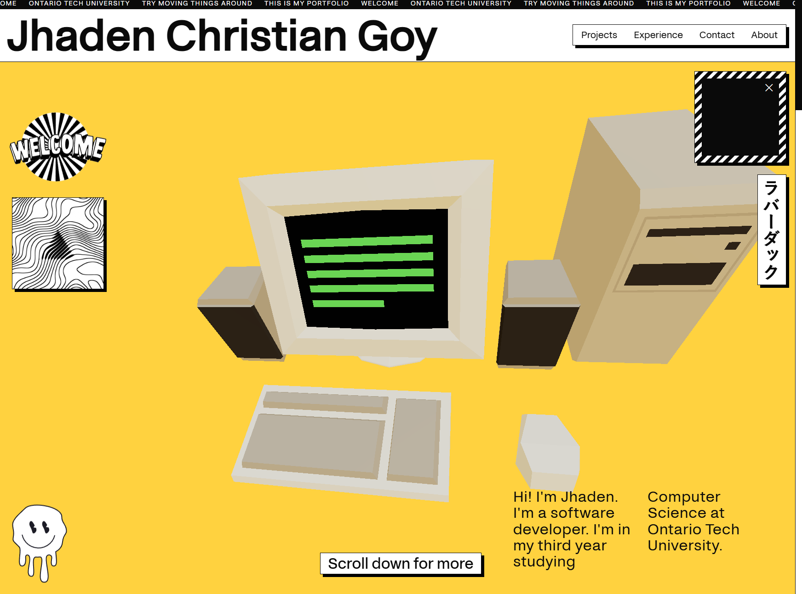
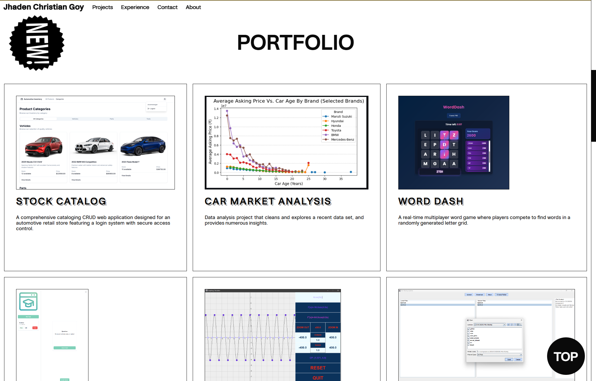
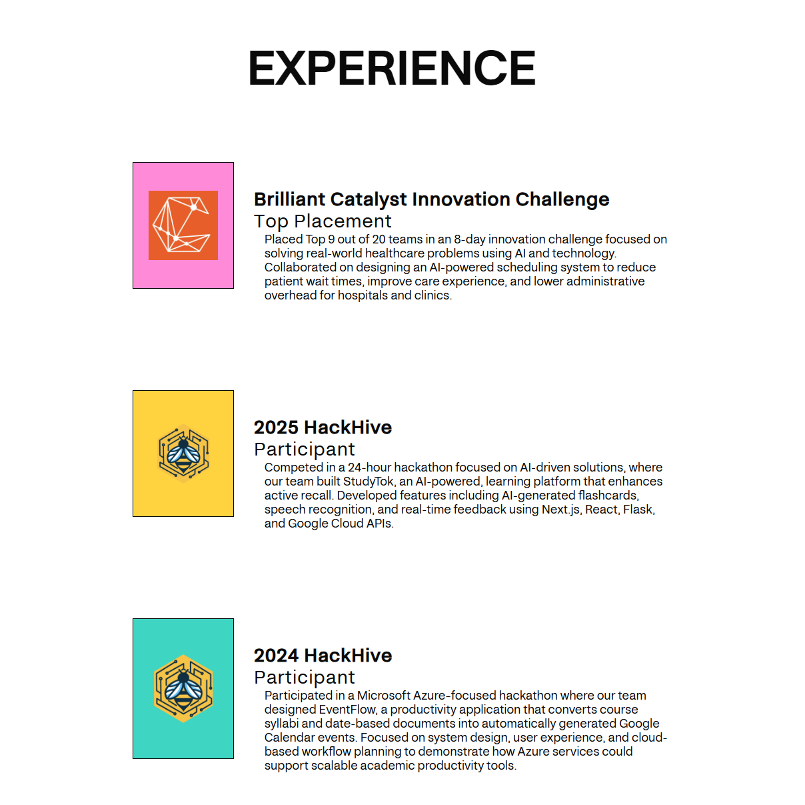
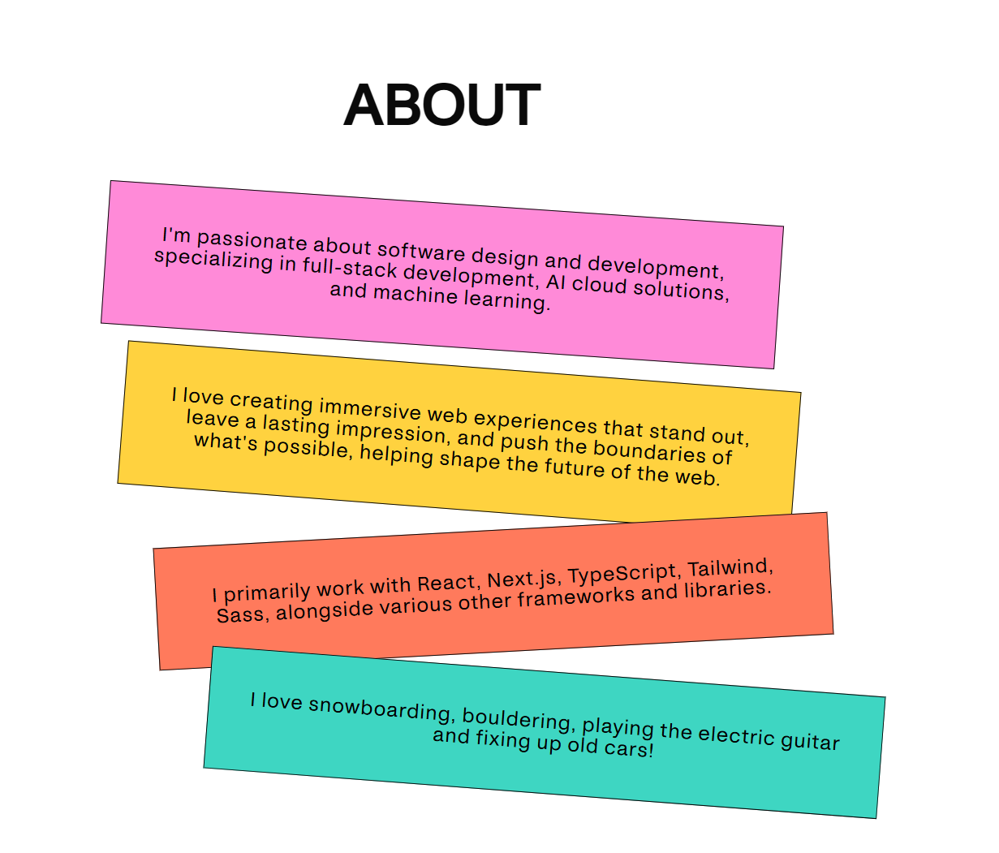

  
  <h4>Main home page of my portfolio website</h4>

## 🛠️ Technologies Used

&nbsp;&nbsp;&nbsp;&nbsp;&nbsp;&nbsp;

&nbsp;&nbsp;&nbsp;&nbsp;&nbsp;&nbsp;

&nbsp;&nbsp;&nbsp;&nbsp;&nbsp;&nbsp;

&nbsp;&nbsp;&nbsp;&nbsp;&nbsp;&nbsp;

The website was handcrafted from scratch using TypeScript, GSAP, and Sass, with no other libraries, frameworks, or templates.

### Other Technologies

 This website uses [WebGL](https://www.khronos.org/webgl/) shader to make a TV signal noise effect, and for the 3D computer [three.js](https://threejs.org/), a library and API to use 3D computer graphics in the browser using WebGL via [React Three Fiber](https://r3f.docs.pmnd.rs/getting-started/introduction), a React renderer for three.js.

### Minimal Version

Due to the website’s colorful design and animations, it may be challenging for users with disabilities to navigate. To improve accessibility, I’ve also created a minimal version, available via the footer link, which points to (COMING SOON).

## 📦 Dependencies

In addition to the tools and technologies mentioned above, this project integrates a custom npm module I created, which handles window layering (bringing windows to the front on click) and drag-and-drop functionality for window movement.

- [DOM Window Manager](https://www.npmjs.com/package/dom-window-manager) (created by Michael Kolesidis)

## 💻 Software used

### Development

- Visual Studio Code
- Google Chrome
- Blender
- Adobe Illustrator
- Adobe Photoshop
- Inkscape
- Krita
- Ableton Live
- Audacity
- GNOME Screenshot
- KDE Spectacle
- Windows Terminal
- GNOME Terminal

### Testing

- Chromium
- Mozilla Firefox
- GNOME Web
- Microsoft Edge
- Safari

## 🎨 Design

### Color Palette

| HEX     |      RGB      |
| ------- | :-----------: |
| #ff90e8 | 255, 144, 232 |
| #ffc900 |  255, 201, 0  |
| #ff7051 | 255, 112, 81  |
| #3ecfc1 | 62, 207, 193  |
| #90a8ed | 144, 168, 237 |
| #ffffff | 255, 255, 255 |
| #0a0a0a |  10, 10, 10   |

### Screenshots

 
  
  
  
  

### Cursors

  
  
  

## ✉️ Contact

Feel free to contact me for business inquiries, feedback, bug reports, or general comments.

## 📜 License

Computer Generic 2000s by Charlie [CC-BY] (https://creativecommons.org/licenses/by/3.0/) via Poly Pizza (https://poly.pizza/m/P90iu7e4gY)

The code is licensed under the [GNU Affero General Public License v3.0](https://www.gnu.org/licenses/agpl-3.0.html).  

The graphics, images, and cursors, are licensed under the [Creative Commons Attribution-ShareAlike 4.0 International](https://creativecommons.org/licenses/by-sa/4.0/).

